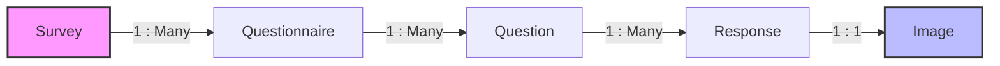
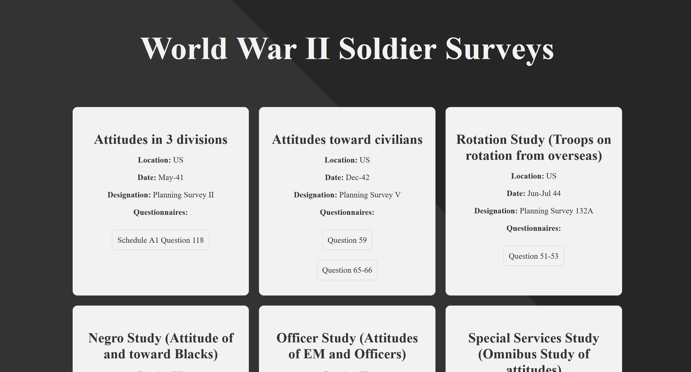
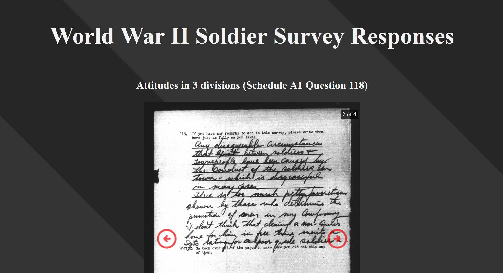

# WWII Soldier Surveys
A data‑driven React project that loads, parses, and displays historical WWII soldier surveys and their original handwritten responses, using a simple two‑view interface built on a relational dataset.

---

## Demo & Live Site
Click the preview below or visit [wwii-soldier-surveys.bdtripp.com](https://wwii-soldier-surveys.bdtripp.com/) to explore the live site.

<a href="https://wwii-soldier-surveys.bdtripp.com/" target="_blank">
  
</a>

---

## Why This Project Matters

This project takes a collection of digitized handwritten WWII soldier surveys from the National Archives and presents them through a clean, data‑driven interface. These documents capture the voices of individual soldiers in their own handwriting, offering a rare look into daily life, morale, and personal experiences during the war. By parsing and integrating this data into a modern web application, the project makes these historical records accessible while demonstrating practical skills in handling real‑world datasets.

From an engineering perspective, the project demonstrates practical skills in:

- **Parsing multiple structured CSV datasets** with Papa Parse and transforming them into relational data models used across the application.
- **Managing shared application state** for surveys, questionnaires, questions, and responses, including loading and error handling at the top level.
- **Implementing client‑side routing** with React Router to support a clean two‑page interface for browsing surveys and viewing handwritten responses.
- **Linking related records across datasets** (survey → questionnaire → questions → responses) to dynamically filter and display the correct images and metadata.
- **Rendering a collection of scanned images efficiently** through a custom, responsive image carousel.
- **Building a fully client‑side React application** that loads, transforms, and displays data without relying on a backend.

The result is a focused, technically grounded project that combines modern frontend engineering with relational data modeling and digitized WWII survey data, demonstrating attention to detail, thoughtful UI design, and the ability to work with real‑world archival datasets.

---

## How It Works

The application loads four CSV datasets (surveys, questionnaires, questions, and responses) on startup and transforms them into a relational structure entirely in the browser. Papa Parse is used to parse each file, after which the data is linked by identifier:

### Data Model Diagram



All parsed data is stored in shared React state at the top level of the application. Once loaded, the app exposes two main routes:

- **Home View (`/`)** — Displays all surveys and their associated questionnaires. Users select a questionnaire to explore its questions and handwritten responses.

- **Responses View (`/responses`)** — Displays the typed questions and original handwritten responses for the questionnaire selected on the Home page. The selected questionnaire is determined using the `questionnaireId` query parameter in the URL (e.g., `/responses?questionnaireId=S002w`).

When viewing a questionnaire, the application dynamically filters the linked questions and responses, resolves the correct scanned image for each response, and displays them through a responsive image carousel. All data loading, parsing, and rendering happens entirely client‑side with no backend required.

---

## Tech Stack

### Frontend & Architecture

- **React 19** — UI rendering and component architecture  
- **React Router** — client-side routing for Home and Responses views  
- **Papa Parse** — CSV parsing and transformation into relational data  
- **JavaScript** — data modeling, filtering, and shared state management  
- **Vite** — development server and build tool  
- **CSS Grid** — responsive layout and custom image carousel  

### DevOps & Deployment
- **Nginx** — serving the production build inside Docker  
- **Docker** — containerized deployment for local and VPS environments  
- **CI/CD (GitHub Actions)** — automated build and deployment pipeline for the Dockerized app

---

## Run the Project (For Developers)
Follow these steps to run the project locally.

### Prerequisites
Make sure you have the following installed:

- **Node.js** (version 18 or higher recommended)
- **npm** (comes with Node)

You can verify your versions using:

```bash
node -v
npm -v
```

### Clone the Repository
```bash
git clone https://github.com/bdtripp-dev/wwii-soldier-surveys.git
cd wwii-soldier-surveys
```

### Installation
Install all project dependencies:

```bash
npm install
```

### Running the Development Server
Start the React development server:

```bash
npm run dev
```
The application will be available at:

http://localhost:5173

### Dataset Requirements
The browser fetches and parses four CSV datasets at runtime:

- surveys.csv
- questionnaires.csv
- questions.csv
- responses.csv

These files must remain in the following directory:

`/public/data/`

No backend is required — all parsing and data linking happens client‑side.

### Optional: Run with Docker
If you prefer running the project in a container:

```bash
docker build -t wwii-surveys .
docker run -p 3000:80 wwii-surveys
```

> The `-p 3000:80` flag maps your machine’s port 3000 to port 80 inside the container, where Nginx serves the production build.

Open your browser and go to:

http://localhost:3000

---

## Screenshots

### Home View


### Responses View
